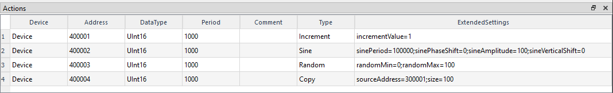

# Modbus Tools

## Overview

ModbusTools are cross-platform (Windows, Linux) Modbus simulator tools (client and server) with GUI to work with standard Modbus Protocol. Modbus Tools are a free, open-source  tools with a simple user interface written in C++/Qt. It implements TCP, RTU and ASCII versions of Modbus Protocol.

Software implements such Modbus functions as:
* `1 ` (`0x01`) - `READ_COILS`
* `2 ` (`0x02`) - `READ_DISCRETE_INPUTS`
* `3 ` (`0x03`) - `READ_HOLDING_REGISTERS`
* `4 ` (`0x04`) - `READ_INPUT_REGISTERS`
* `5 ` (`0x05`) - `WRITE_SINGLE_COIL`
* `6 ` (`0x06`) - `WRITE_SINGLE_REGISTER`
* `7 ` (`0x07`) - `READ_EXCEPTION_STATUS`
* `15` (`0x0F`) - `WRITE_MULTIPLE_COILS`
* `16` (`0x10`) - `WRITE_MULTIPLE_REGISTERS`
* `22` (`0x16`) - `MASK_WRITE_REGISTER` (since v0.3)
* `23` (`0x17`) - `WRITE_MULTIPLE_REGISTERS` (since v0.3)

ModbusTools work with Qt Framework version 5 (5.8 or later).
It based on `ModbusLib` cross platform library project:

https://github.com/serhmarch/ModbusLib

## Release

All compiled binaries are located in latest release:

https://github.com/serhmarch/ModbusTools/releases

## About Modbus Client

The client implements access to a remote Modbus device. However, the client can work not only with one device, but with several devices that can be connected to a single network, which is especially useful when working with RTU and ASCII protocols, when access to all Modbus servers is realized through a single serial port. However, it can also be useful when using the TCP version of the protocol, for example, if you use the TCP->RTU bridge.


All work is done within a single project. The main entities in the project are Port, Device and DataViewItem. Port contains network settings for both TCP/IP and serial ports. Device contains settings for a single device (such as Modbus Unit Address, etc.).  The DataViewItem contains a single data unit to be read from the remote device and has many formats to represent the current data.

### Send Message window

The client has the ability to process one separate Modbus function with full configuration of the parameters of this function, view/edit read/write data with the format specified, view Modbus packets of this function:


This window can be opened using menu `Runtime->Send Message` in run mode. It works in parallel with regular Modbus application messages and can be seen in LogView as regular Modbus message as well.

### Scanner window (since v0.3)

`Scanner` tool window is intended to scan Modbus network to determine which device 
with current settings are present in the network.


Scanner scans Modbus network in range [`UnitStart`:`UnitEnd`] with `tries` attempts count.
The request can be customized using `Scanner Request`-dialog, 
which is called using `...` button in `Request` field.

There is a list of founded devices in central widget.
Founded devices can be add to the current project:
button `To Project` add selected devices, `All To Project` - all devices will be added to the project.

## About Modbus Server

The server implements Modbus server device and works like Modbus simulator. However, the server can  not only simulate single device, but can simulate several devices that can be connected to a single network, which is especially useful when working with RTU and ASCII protocols, when access to all Modbus servers is realized through a single serial port. However, it can also be useful to simulate Modbus network using the TCP version of the protocol, for example, if you use the TCP->RTU bridge, Modbus server can replace this bridge with remote devices for testing purposes.


All work is performing within a single project. The main entities in the project are Port, Device, DataViewItem and Action. Port contains network settings for both TCP/IP and serial ports. Device contains settings for a single device (such as Modbus Unit Address, memory size etc).  The DataViewItem contains a single data unit to be read/write from the device and has many formats to represent the current data. Action provides simulation capabilities (automatic change of device memory values).

### Server Actions window

The server has the ability to simulate data (actions, automaticaly change values) with predefined action types (`Actions` tab near `LogView`, menu `View->Actions` window and menu `Actions`):
* `Increment` - changing value by adding or subtracting (if incrementValue < 0) incrementValue
* `Sine` - sine function with parameters of period, shift, amplitude
* `Random` - randomly changing values with specified range
* `Copy` - move data from one memory part to another (with same or different memory types)



## Building ModbusTools from source on Windows

### Preparation

The ModbusTools project requires Qt version 5.8 or later.

1. Download qt-online-installer, follow the link and choose Windows version for installer:

https://www.qt.io/download-qt-installer

2. Run qt-online-installer and install all necessary components: Qt 5 (Qt5.15.2) framework.

Qt 5.8 or higher is needed so in `Select Components` window check `Archive` checkbox and push `Filter` button.
Then is better to check latest version of Qt5.15 fr (e.g. 5.15.2)

3. Download and install git for Windows or use WSL and install git for WSL.

4. Make dir for binaries, e.g. in `<user-home-dir>\bin\ModbusTools` using Windows command console:
    ```console
    >cd `<user-home-dir>`
    >mkdir bin\ModbusTools
    >cd bin\ModbusTools
    ```

### Build using qmake

This example shows how to build `ModbusTools` for MSVC compiler using `qmake`.

1. Open Windows command console and initialize all MSVC compiler vars (e.g. include, lib) using `vcvarsall.bat` script.
This script will be configured for x64 arch (use `...\vcvarsall.bat -help` to display all options):
    ```console
    >"c:\Program Files\Microsoft Visual Studio\2022\Community\VC\Auxiliary\Build\vcvarsall.bat" x64
    ```

2. Run qmake to produce `Makefile`. 
This command will make `Release` version, for `Debug` replase with `"CONFIG+=debug"`:
    ```console
    >C:\Qt\5.15.2\msvc2019_64\bin\qmake.exe path\to\ModbusTools.pro -spec win32-msvc "CONFIG+=release"
    ```

3. Produce all make files:
    ```console
    >C:\Qt\Tools\QtCreator\bin\jom\jom.exe -f Makefile qmake_all
    ```

4. Build project from Makefile's:
    ```console
    >C:\Qt\Tools\QtCreator\bin\jom\jom.exe
    ```

### Build using cmake

1.  Run cmake to generate project (make) files. 
`CMAKE_PREFIX_PATH` must be set to installed Qt framewrok files:
    ```console
    >cmake -DCMAKE_PREFIX_PATH:PATH=C:/Qt/5.15.2/msvc2019_64 -S path\to\ModbusTools -B .
    ```
2.  Make binaries (+ debug|release config):
    ```console
    $ cmake --build .
    $ cmake --build . --config Debug
    $ cmake --build . --config Release
    ```    
    
3.  Resulting bin files is located in `Debug` or `Release` directory.

#### Build using CMakePresets.json

```console
cmake --preset "Win64-MSVC-Debug"
cmake --build --preset "Win64-MSVC-Debug"

cmake --preset "Win64-MSVC-Release"
cmake --build --preset "Win64-MSVC-Release"
```    

## Building ModbusTools from source on Linux

### Preparation

The ModbusTools project requires Qt version 5.8 or later.

1.  Update package list:
    ```console
    $ sudo apt-get update
    ```

2.  Install main build tools like g++, make etc:
    ```console
    $ sudo apt-get install build-essential
    ```

3.  Install Qt tools:
    ```console
    $ sudo apt-get install qtbase5-dev qttools5-dev
    ```

4.  Check for correct instalation:
    ```console
    $ whereis qmake
    qmake: /usr/bin/qmake
    $ whereis libQt5Core*
    libQt5Core.prl: /usr/lib/x86_64-linux-gnu/libQt5Core.prl
    libQt5Core.so: /usr/lib/x86_64-linux-gnu/libQt5Core.so
    libQt5Core.so.5: /usr/lib/x86_64-linux-gnu/libQt5Core.so.5
    libQt5Core.so.5.15: /usr/lib/x86_64-linux-gnu/libQt5Core.so.5.15
    libQt5Core.so.5.15.3: /usr/lib/x86_64-linux-gnu/libQt5Core.so.5.15.3
    $ whereis libQt5Help*
    libQt5Help.prl: /usr/lib/x86_64-linux-gnu/libQt5Help.prl
    libQt5Help.so: /usr/lib/x86_64-linux-gnu/libQt5Help.so
    libQt5Help.so.5: /usr/lib/x86_64-linux-gnu/libQt5Help.so.5
    libQt5Help.so.5.15: /usr/lib/x86_64-linux-gnu/libQt5Help.so.5.15
    libQt5Help.so.5.15.3: /usr/lib/x86_64-linux-gnu/libQt5Help.so.5.15.3
    ```

5.  Install git:
    ```console
    $ sudo apt-get install git
    ```

6.  Create project directory, move to it and clone repository:
    ```console
    $ cd ~
    $ mkdir src
    $ cd src
    $ git clone --recursive https://github.com/serhmarch/ModbusTools.git
    ```

7.  Create and/or move to directory for build output, e.g. `~/bin/ModbusTools`:
    ```console
    $ cd ~
    $ mkdir -p bin/ModbusTools
    $ cd bin/ModbusTools
    ```

### Build using qmake

1.  Run qmake to create Makefile for build:
    ```console
    $ qmake ~/src/ModbusTools/src/ModbusTools.pro -spec linux-g++
    ```

2.  To ensure Makefile was created print:
    ```console
    $ ls -l
    total 36
    -rw-r--r-- 1 march march 35001 May  6 18:41 Makefile
    ```
3. Finaly to make current set of programs print:
    ```console
    $ make
    ```

4. After build step move to `<build_folder>/bin` to ensure everything is correct:
    ```console
    $ cd bin
    $ pwd
    ~/bin/ModbusTools/bin
    $ ls -l
    total 2672
    -rwxr-xr-x 1 march march 643128 May  6 18:45 client
    lrwxrwxrwx 1 march march     16 May  6 18:44 libcore.so -> libcore.so.0.1.4
    lrwxrwxrwx 1 march march     16 May  6 18:44 libcore.so.0 -> libcore.so.0.1.4
    lrwxrwxrwx 1 march march     16 May  6 18:44 libcore.so.0.1 -> libcore.so.0.1.4
    -rwxr-xr-x 1 march march 993376 May  6 18:44 libcore.so.0.1.4
    -rwxr-xr-x 1 march march 907872 May  6 18:47 server
    ```
### Build using cmake

1.  Run cmake to generate project (make) files.
    ```console
    $ cmake -S ~/src/ModbusTools -B .
    ```    

2.  Make binaries (+ debug|release config):
    ```console
    $ cmake --build .
    $ cmake --build . --config Debug
    $ cmake --build . --config Release
    ```    
    
3.  Resulting bin files is located in `./bin` directory.

#### Build using CMakePresets.json

```console
cmake --preset "Linux-Debug"
cmake --build --preset "Linux-Debug"

cmake --preset "Linux-Release"
cmake --build --preset "Linux-Release"


