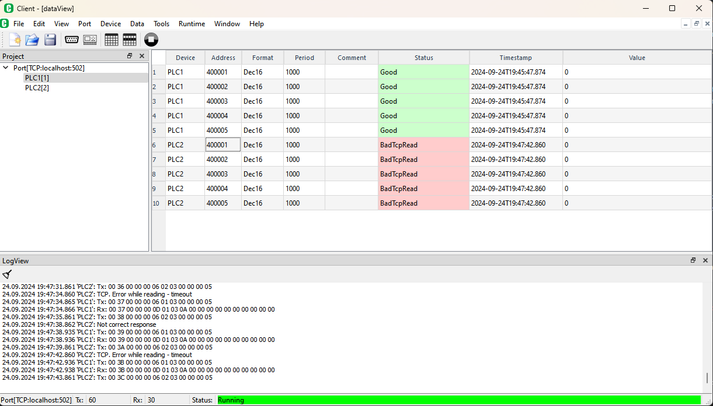
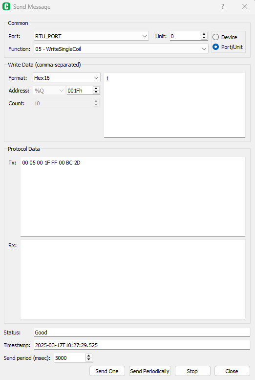
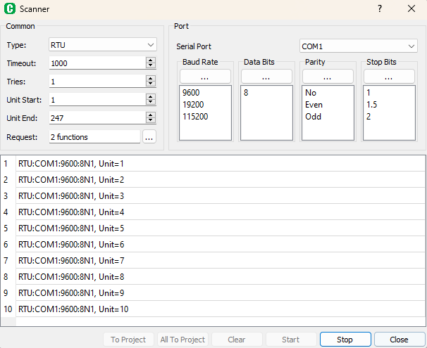
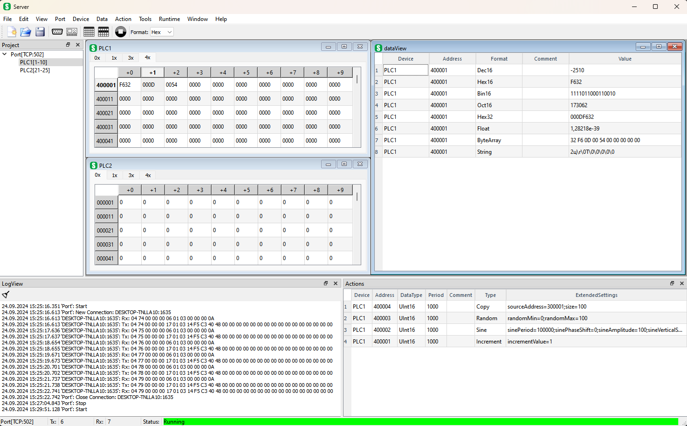
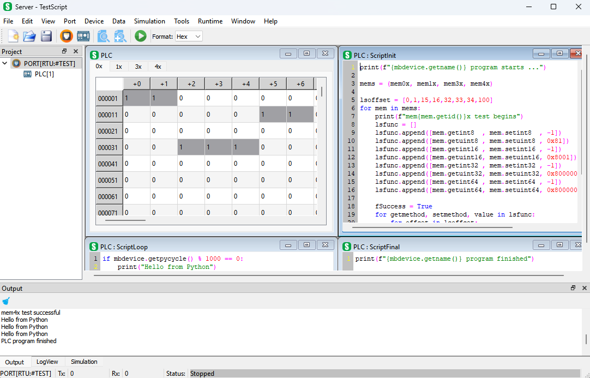
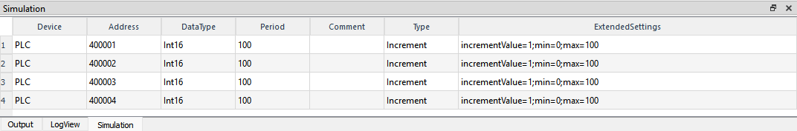

# Modbus Tools

## Overview

ModbusTools are cross-platform (Windows, Linux) Modbus simulator tools (client and server) with GUI
to work with standard Modbus Protocol. 
Modbus Tools are a free, open-source  tools with a simple user interface written in C++/Qt. 
It implements TCP, RTU and ASCII versions of Modbus Protocol.

### *New in version 0.4*:

*From now server application allows you to create program logic for the Modbus device simulator 
using your favorite Python programming language.*

Software implements such Modbus functions as:
* `1 ` (`0x01`) - `READ_COILS`
* `2 ` (`0x02`) - `READ_DISCRETE_INPUTS`
* `3 ` (`0x03`) - `READ_HOLDING_REGISTERS`
* `4 ` (`0x04`) - `READ_INPUT_REGISTERS`
* `5 ` (`0x05`) - `WRITE_SINGLE_COIL`
* `6 ` (`0x06`) - `WRITE_SINGLE_REGISTER`
* `7 ` (`0x07`) - `READ_EXCEPTION_STATUS`
* `15` (`0x0F`) - `WRITE_MULTIPLE_COILS`
* `16` (`0x10`) - `WRITE_MULTIPLE_REGISTERS`
* `17` (`0x11`) - `REPORT_SERVER_ID` (since v0.4)
* `22` (`0x16`) - `MASK_WRITE_REGISTER` (since v0.3)
* `23` (`0x17`) - `READ_WRITE_MULTIPLE_REGISTERS` (since v0.3)

ModbusTools work with Qt Framework version 5 (5.8 or later).
It based on `ModbusLib` cross platform library project:

https://github.com/serhmarch/ModbusLib

### Memory item addressing

Modbus Tools uses a 6-digit memory addressing type.
The left digit indicates the memory type (`0`, `1`, `3` or `4`) and
the right 5 digits indicate the address of the memory cell starting from 1 - [1:65536].

__*New in version 0.4*__:
> IEC61131-3 addressing type is available. There is a setting that allows you to choose between
standard Modbus (1 based) and IEC61131-3 (0 based) addressing types.

Memory types decribed below:

* `0x` - intended for coils (discrete outputs, boolean), corresponding modern PLC notation is `%M` or `%Q`
(e.g. `000001 `coil in modern notation can be accessed like `%M0` or `%Q0`), can have Read/Write access,
corresponding access functions are `READ_COILS `(which number is `1`) and `WRITE_MULTIPLE_COILS`(`15`, `0x0F`);

* `1x` - intended for discrete inputs (boolean), corresponding modern PLC notation is `%I`
(e.g. `100001 `boolean in modern notation can be accessed like `%I0`), has ReadOnly access,
corresponding access function is `READ_DISCRETE_INPUTS `(`2`);

* `3x` - intended for input registers (analog inputs, 16 bit word), corresponding modern PLC notation is `%IW`
(e.g. `300001 `word in modern notation can be accessed like `%IW0`), has ReadOnly access,
corresponding access function is `READ_INPUT_REGISTERS`(`4`);

* `4x` - intended for holding registers (analog outputs, 16 bit word), corresponding modern PLC notation is `%MW`
(e.g. `400001 `word in modern notation can be accessed like `%MW0`), , can have Read/Write access,
corresponding access functions are `READ_HOLDING_REGISTERS`(`3`) and `WRITE_MULTIPLE_REGISTERS`(`16`, `0x10`);

Addressing examples:
| Memory type       | Standard (1 based) | IEC 61131-3 (0 based)
|-------------------|--------------------|-------------------------
| Coils             | `000001`           | `%Q0` 
| Discrete inputs   | `100001`           | `%I0`
| Input registers   | `300001`           | `%IW0`
| Holding registers | `400001`           | `%MW0`

## Release

All compiled binaries are located in the latest release:

https://github.com/serhmarch/ModbusTools/releases

## About Modbus Client

The client implements access to a remote Modbus device. 
However, the client can work not only with one device, but with several devices that can be connected to
a single network, which is especially useful when working with RTU and ASCII protocols, 
when access to all Modbus servers is realized through a single serial port. 
However, it can also be useful when using the TCP version of the protocol, for example,
if you use the TCP->RTU bridge.



All work is done within a single project. The main entities in the project are Port, Device and DataViewItem.
Port contains network settings for both TCP/IP and serial ports. 
Device contains settings for a single device (such as Modbus Unit Address, etc.).  
The DataViewItem contains a single data unit to be read from the remote device and 
has many formats to represent the current data.

### Send Message window

The client has the ability to process one separate Modbus function with full configuration of the parameters 
of this function, view/edit read/write data with the format specified, view Modbus packets of this function:



This window can be opened using menu `Tools->Send Message`. 
It works in parallel with regular Modbus application messages and 
can be seen in LogView as regular Modbus message as well.

### Scanner window (since v0.3)

`Scanner` tool window is intended to scan Modbus network to determine which device 
with current settings are present in the network.
This window can be opened using menu `Tools->Scanner`



Scanner scans Modbus network in range [`UnitStart`:`UnitEnd`] with `tries` attempts count.
The request can be customized using `Scanner Request`-dialog, 
which is called using `...` button in `Request` field.

There is a list of found devices in central widget.
Found devices can be add to the current project:
button `To Project` add selected devices, `All To Project` - all devices will be added to the project.

## About Modbus Server

The server implements Modbus server device and works like Modbus simulator. 
However, the server can  not only simulate single device, but can simulate several devices that can be connected
to a single network, which is especially useful when working with RTU and ASCII protocols, 
when access to all Modbus servers is realized through a single serial port. 
However, it can also be useful to simulate Modbus network using the TCP version of the protocol, 
for example, if you use the TCP->RTU bridge, Modbus server can replace this bridge with remote devices 
for testing purposes.



All work is performing within a single project. 
The main entities in the project are Port, Device, DataViewItem and Action. 
Port contains network settings for both TCP/IP and serial ports. 
Device contains settings for a single device (such as Modbus Unit Address, memory size etc).  
The DataViewItem contains a single data unit to be read/write from the device and has many formats to 
represent the current data. Action provides simulation capabilities (automatic change of device memory values).

### Scripting using Python (since v0.4)

Since v0.4 version 'server' application allows to extend logic of your Modbus device 
simulator using one the most popular programming language - Python.
All you need to use scripting is installed Python interpreter and `PyQt5` library.



`server` application gives you access to the device's internal Modbus memory and
provides `Output` window where standard output is redirected.
The rest is the power of Python, its standard library, 3rd party libraries,
and your own libraries and scripts.

Every device has its own set of scripts: `Init`, `Loop` and `Final`.
Those scripts accessable through device menu or contex menu for device.

`Init` script performs once at program start (when push `Start` button).
It intended for making python `import` instructions, create objects, files etc.
Modules, objects and files created within will be accessable from `Loop` and `Final` scripts.

`Loop` script performs cyclic until program is stopped.
It has implicit cycle so user don't have to cycle his program manualy.

`Final` script performs once at program stop (when push `Stop` button).
It intended for release resources previously created in `Init` and `Loop` scripts, save files etc.

Standard objects for access corresponding device memory: `mem0x`, `mem1x`, `mem3x`, `mem4x`.

Every object has set of get/set function to work with different data types:
 * `mem0x`, `mem1x`: `get<datatype>(bitoffset:int)->int` and `set<datatype>(bitoffset:int,value:int)`
 * `mem3x`, `mem4x`: `get<datatype>(regoffset:int)->int` and `set<datatype>(regoffset:int,value:int)`

`<datatype>`: `int8`, `uint8`, `int16`, `uint16`, `int32`, `uint32`, `int64`, `uint64`, `float`, `double`.

Examples:
```python
 v = mem0x.getint8(0)
 mem1x.setint16(1, -1)
 mem3x.setuint16(0, 65535)
 mem4x.setdouble(10, 2.71828)
```

Also index operation is supported.
In case of discrete memory (`mem0x`, `mem1x`) it work with `boolean` values
and for registers memory (`mem3x`, `mem4x`) it work with `uint16` values:

```python
 b0 = mem0x[0]
 mem1x[38] = True
 mem3x[100] = 65535
 if mem4x[0] > 32768:
     mem4x[0] = 0 
```

To view all documentation and possible uses of objects and methods, use the built-in help system.

### Server Simulation window

The server has the ability to simulate/change data (actions, automaticaly change values)
with predefined simulation action types (`Simulation` tab near `LogView`,
menu `View->Simulation` window and menu `Simulation`):
* `Increment` - changing value by adding or subtracting (if incrementValue < 0) incrementValue
* `Sine` - sine function with parameters of period, shift, amplitude
* `Random` - randomly changing values with specified range
* `Copy` - move data from one memory part to another (with same or different memory types)


